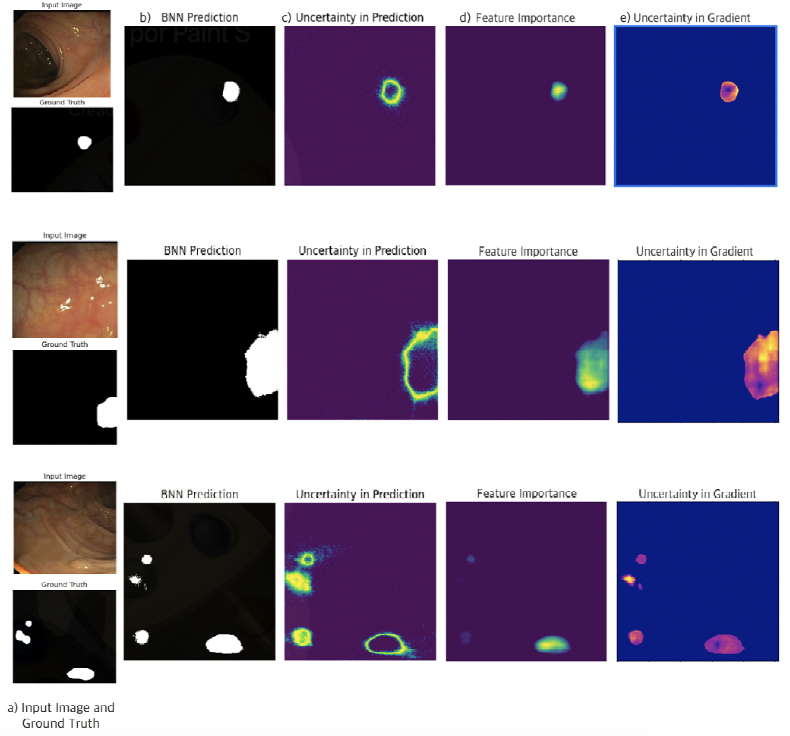

<h1 align="center">Deep Bayesian segmentation for colon polyps: Well-calibrated predictions in medical imaging</h1>
<p align="center">
  <strong>Author:</strong> Hector J. Hortua<br>
  <strong>Paper:</strong> <a href="http:under review" target="_blank"> Deep Bayesian segmentation for colon polyps: Well-calibrated predictions in medical imaging </a>
</p>

<p align="center">
<kbd>
  
</kbd>
</p>

## How to Use the Code

1. **Data Processing**
    Include path of the CVC-CLINICDB database.

2. **Model Training**
     ```python
     Script_end_to_end.ipynb
     ```
3. **Model Testing**
     ```python
     Script_Test.ipynb
     ```
4. **Google Colab**

  - This repository can be used via Google Colab:
  <a target="_blank" href="https://colab.research.google.com/github.com/JavierOrjuela/medical-interpretability-polyp-detection">
  
</a>
